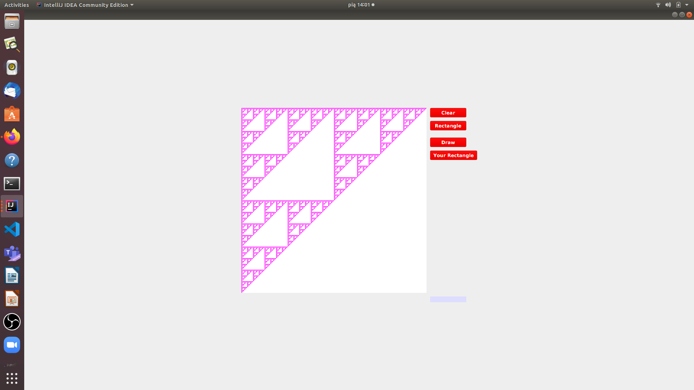

# Sierpiński Triangle
> This is a JavaFX aplication drawing Sierpiński Triangle.

## Sierpiński Triangle
This is a JavaFX aplication drawing Sierpiński Triangle. For academic reason in this project I'm also using complex numbers.

## Screenshots

## Technologies
* Java JDK11 - version 11.0.10
* JavaFX - version 11.0.2-internal

## Status
Project is:  _finished_.
